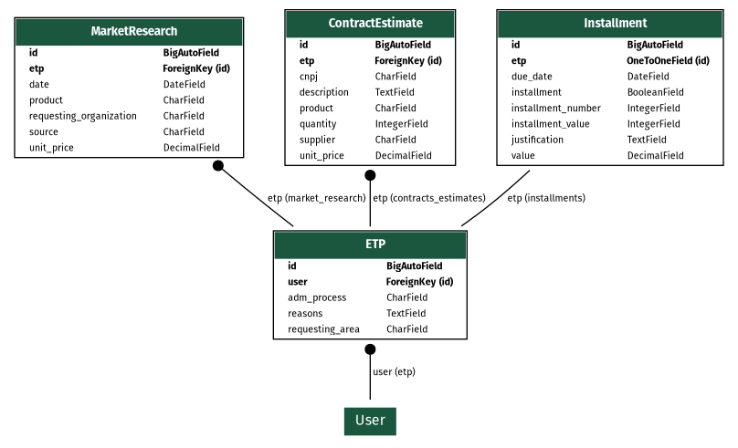

# Licitação.Rio

Esta é uma aplicação que tem como objetivo facilitar a criação, busca e acompanhamento de licitações públicas na cidade do Rio de Janeiro. A aplicação foi desenvolvida em Python e utiliza o framework [Django](https://www.djangoproject.com/) como backend, e os frameworks [HTMX](https://htmx.org/) e [PicoCSS](https://picocss.com.) como frontend.

## Modelagem do banco de dados

